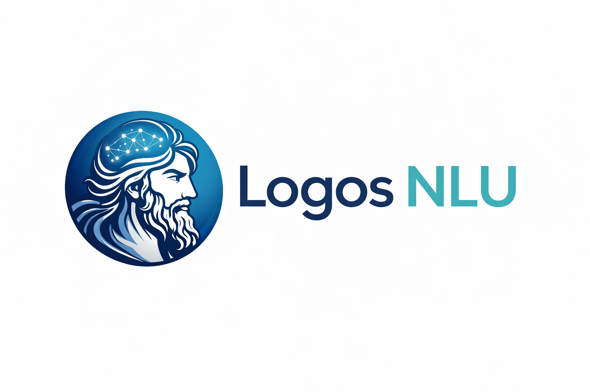

**Logos NLU** is a lightweight, self-hosted Natural Language Understanding (NLU) service for intent classification and entity extraction.

It is designed to be:
- ✅ Simple
- ✅ Inspectable
- ✅ Deterministic
- ✅ Free from cloud lock-in

Logos NLU focuses on **semantic intent detection using sentence embeddings**, not black-box AI pipelines.

> [!WARNING]
> This project is very alpha and under heavy development!

---

## Why Logos NLU?

Most NLU systems are either:
- Overly complex
- Tied to SaaS platforms
- Hard to debug
- Impossible to extend cleanly

Logos NLU takes a different approach:
- Uses sentence embeddings + cosine similarity
- No retraining required after restart
- Intents and embeddings are persisted
- Entities are explicit and hackable

> If you can read Python, you can understand Logos NLU.

Logos aims to be a simple, self-hosted, offline, NLU service that you can use for internal chatbot systems.

---

## Features

- 🧠 Semantic intent classification
- 📦 Project-based intent storage
- 💾 Persistent embeddings
- 🧩 Simple entity extraction
- ⚡ FastAPI-based HTTP API
- 🧪 Easy to test and extend

---

## Non-Goals

Logos NLU intentionally does **not** aim to:
- Replace large LLMs
- Do generative AI
- Perform end-to-end dialogue management
- Hide complexity behind configuration magic

This is an **NLU engine**, not a chatbot. Thought it's simple REST API makes it a great choice for use with chatbot platforms like [Typebot.io](https://typebot.io/)

---

## Installation

> [!IMPORTANT]
> Both Dockerfile and docker-compose.yaml files have been included for building and running Logos-nlu-server in docker. Note that the Dockerfile uses `Python 3.10-slim` in order to keep the image size small.
>
> Take caution as both files are a work in progress.

```bash
git clone https://github.com/ATXCoder/logos-nlu-server.git
cd logos-nlu-server

python -m venv venv
source venv/bin/activate  # Windows: venv\Scripts\activate

pip install -r requirements.txt

python -m spacy download en_core_web_sm
```

## Running the server

```bash
uvicorn app.main:app --reload --port 8001
```
API will be available at `http://localhost:8001`

## Example Dataset

Logos NLU operates on projects.
Each project has:

- Intents
- Training utterances
- Stored embeddings

See: data/projects/example_project/intents.json

## Training a Project

Send training data to the training endpoint (or call train_project directly).

Example structure

```json
{
  "project_id": 1,
  "intents": {
    "greet": [
      "hello",
      "hi there",
      "hey"
    ],
    "order_pizza": [
      "I want to order a pizza",
      "Can I get a pepperoni pizza",
      "I'd like to order food"
    ]
  }
}
```

Training generates embeddings and persists them to disk.

## Predicting an Intent

Request

```http
POST /v1/predict
Content-Type: application/json
```
```json
{
  "project_id": 1,
  "text": "I want a large pepperoni pizza"
}
```

Response

```json
{
  "intent": "order_pizza",
  "confidence": 0.82,
  "alternatives": [
    { "intent": "greet", "confidence": 0.41 }
  ],
  "entities": {
    "size": "large",
    "topping": "pepperoni"
  }
}
```